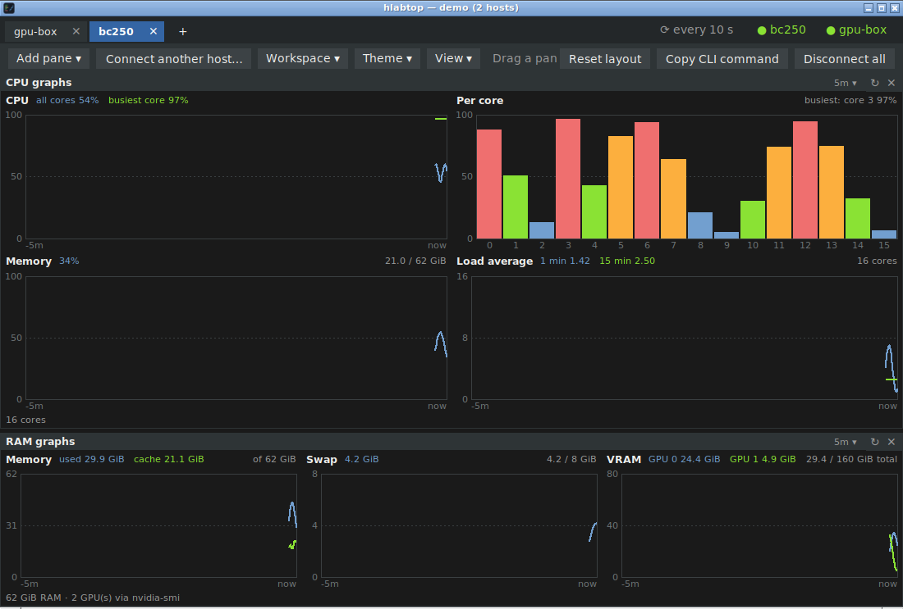

# hlabtop

*top for your homelab.*

hlabtop watches the machines in your homelab from one window: `htop`, your GPU
tools (`nvidia-smi`, `rocm-smi`, `amd-smi`, `nvtop`, …) and live GPU, CPU and RAM
graphs, side by side, over SSH. Nothing to install on the machines you watch —
if you can SSH in, hlabtop can show it.

## Download

Grab the file for your system from the **[latest release](https://github.com/RVP-Techworks/hlabtop/releases/latest)**:

| System | File | How to open it |
|---|---|---|
| Windows 10/11 | `hlabtop-…-windows-x64.exe` | Double-click. SmartScreen may warn about an unknown publisher the first time: **More info → Run anyway**. |
| macOS (Apple Silicon) | `hlabtop-…-macos-arm64.zip` | Unzip, then **right-click `hlabtop.app` → Open** the first time. |
| Linux — Flatpak | `hlabtop-…-x86_64.flatpak` | `flatpak install --user hlabtop-…-x86_64.flatpak`, then open **hlabtop** from your app menu. Best on Bazzite, Fedora Silverblue and other immutable distros. |
| Linux — AppImage | `hlabtop-…-x86_64.AppImage` | `chmod +x` it, then run it. |
| Linux — single file | `hlabtop-…-linux-x86_64` | `chmod +x` it, then run it. Also runs in a terminal: `hlabtop user@host`. |

Everything it needs is bundled; there's nothing else to install.

## What it does

- **Panes you arrange** — htop, btop, top, GPU tools (auto-detected), sensors,
  docker stats, disk usage, `ollama ps`, or any command you like. Drag title bars
  to put them side by side or stacked, in any mix.
- **Live graphs** — GPU utilization, VRAM, temperature, power, clocks and fans
  (NVIDIA and AMD); CPU overall and per core, load, memory, swap and VRAM.
- **Many machines** — one tab per host, or one dashboard mixing panes from
  several hosts. Save the whole setup as a **workspace** and reopen it in one click.
- **Wall-display mode** — cycle through tabs every few seconds, run full screen
  (F11), and the mouse pointer hides when idle. Set it to start with the computer
  and it runs by itself.
- **Stays connected** — drops and sleeps are reconnected automatically.
- **Your SSH setup just works** — `~/.ssh/config` aliases, keys and ssh-agent;
  saved passwords go to the system keychain (Windows Credential Manager, macOS
  Keychain, GNOME Keyring / KWallet).
- **Themes** — Dark, Light, High contrast, Solarized, Dracula and Nord.
- **Terminal mode** — the same panes and graphs in a terminal, for headless use.

## On the machines you watch

Only an SSH server and the tools you want to see: `htop` for the htop pane, and
`nvidia-smi` (NVIDIA driver), `rocm-smi` / `amd-smi` (ROCm) or `nvtop` for GPUs.
The CPU and RAM graphs work on any Linux machine.

## Feedback

Found a bug or have an idea? [Open an issue](https://github.com/RVP-Techworks/hlabtop/issues).

---

Made by [RVP Techworks](https://github.com/RVP-Techworks).
